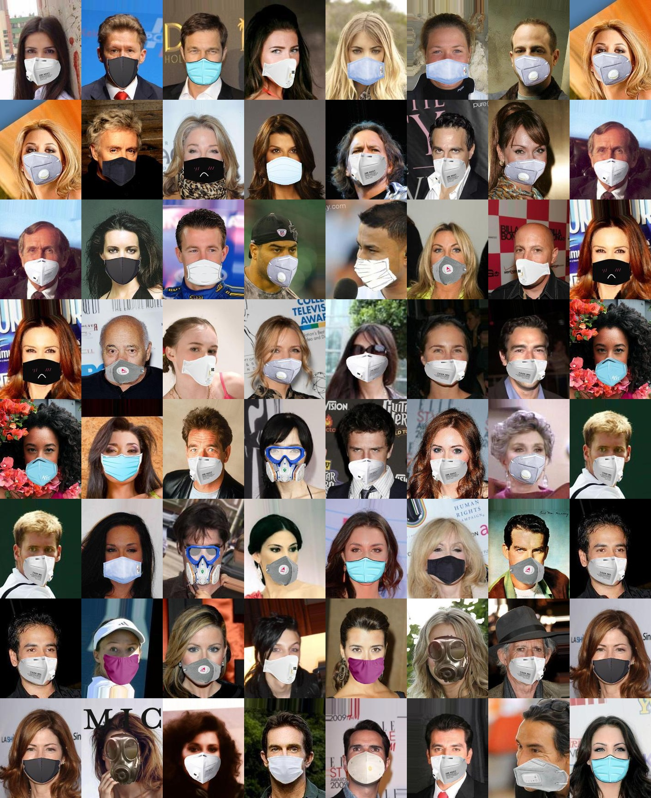
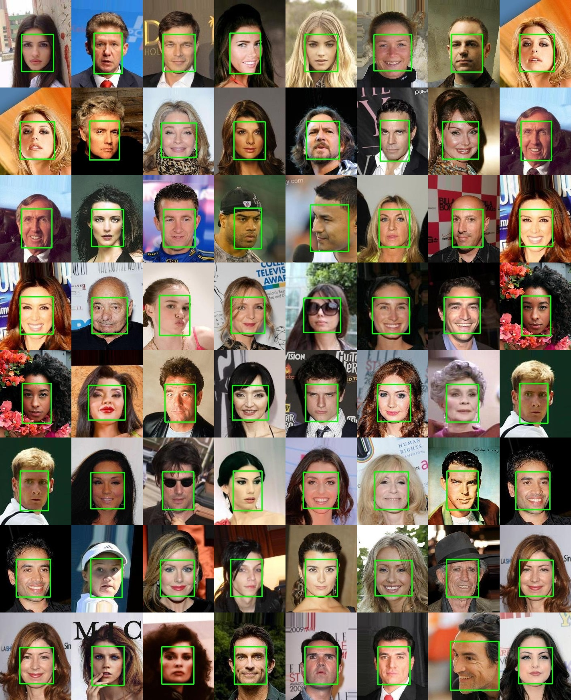

## FaceMask CelebA(simulated masked face with CelebA)
For supplying convenience for the CVer studying the masked face tasks,
we created a simulated masked face dataset based on the CelebA dataset.
### Download
This simulated masked face dataset called FaceMask_CelebA,which include 202599 masked face images and the
modified face bbox label. 

   - Download the [FaceMask_CelebA]()() dataset from BaiDu.

   - Download the [FaceMask_CelebA]() dataset from Google.

   - Visit the [CelebA](http://mmlab.ie.cuhk.edu.hk/projects/CelebA.html) For more Face Attribute annotation and other information. 
### Simulated masked face
>Simulate masked face through the five landmarks.The pasted face mask images(RGBA) are downloaded from net.
>After crop the min area of mask,paste it on the corresponding position.You also can add more face mask image to paste.  

### Face Bounding bbox on aligned images
>Because of the original face bbox not matched,So we modified the face bbox.The face bounding box also generated from the five landmarks. 

